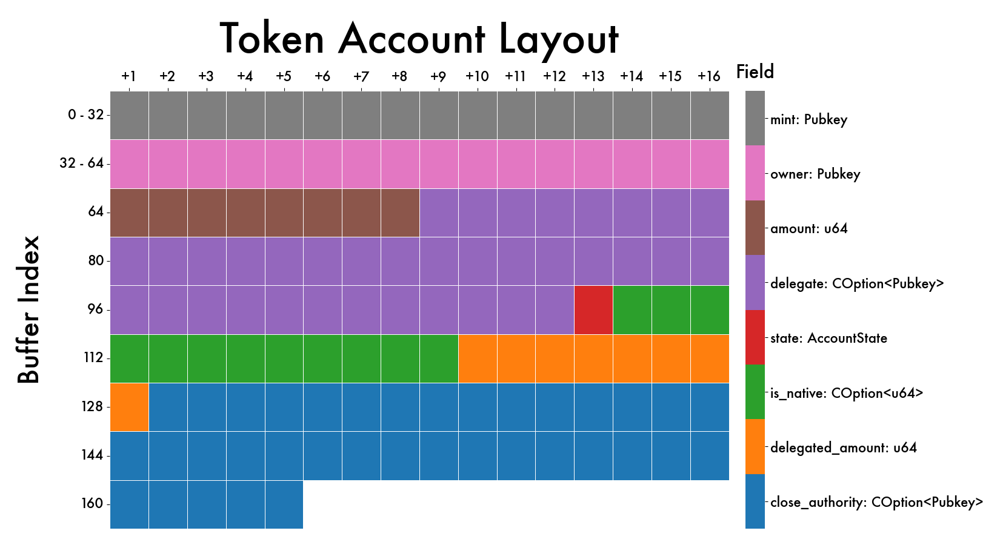
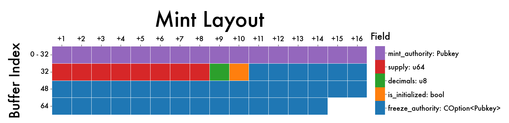

# solana-account-vis
Use Seaborn to visually interpret the byte layout of Solana account types

# Usage
```
from account_visualization import generate_account_visualization
from collections import OrderedDict

token_account = OrderedDict(
    mint=('Pubkey', 32),
    owner=('Pubkey', 32),
    amount=('u64', 8),
    delegate=('COption<Pubkey>', 36),
    state=('AccountState', 1),
    is_native=('COption<u64>', 12),
    delegated_amount=('u64', 8),
    close_authority=('COption<Pubkey>', 36),
)
mint = OrderedDict(
    mint_authority=('Pubkey', 32),
    supply=('u64', 8),
    decimals=('u8', 1),
    is_initialized=(bool, 1),
    freeze_authority=('COption<Pubkey>', 36),
)
token_metadata = OrderedDict(
    key=('Key', 1),
    update_authority=('Pubkey', 32),
    mint=('Pubkey', 32),
    name_size=('usize', 4),
    name=('String', 32),
    symbol_size=('usize', 4),
    symbol=('String', 10),
    uri_size=('usize', 4),
    uri=('String', 200),
    seller_fee_basis_points=('u16', 2),
    creators_size=('usize', 4),
    creator0_pubkey=('Pubkey', 32),
    creator0_verified=('bool', 1),
    creator0_share=('u8', 1),
    creator1_pubkey=('Pubkey', 32),
    creator1_verified=('bool', 1),
    creator1_share=('u9', 1),
    creator2_pubkey=('Pubkey', 32),
    creator2_verified=('bool', 1),
    creator2_share=('u8', 1),
    creator3_pubkey=('Pubkey', 32),
    creator3_verified=('bool', 1),
    creator3_share=('u8', 1),
    creator4_pubkey=('Pubkey', 32),
    creator4_verified=('bool', 1),
    creator4_share=('u8', 1),
    primary_sale_happened=('bool', 1),
    is_mutable=('bool', 1),
    edition_nonce=('Option<u8>', 5),
    padding=('bytes', 176)
)
generate_account_visualization(token_account, title="Token Account Layout")
generate_account_visualization(mint, title="Mint Layout")
generate_account_visualization(token_metadata, title="Token Metadata Layout")
```

# Output




